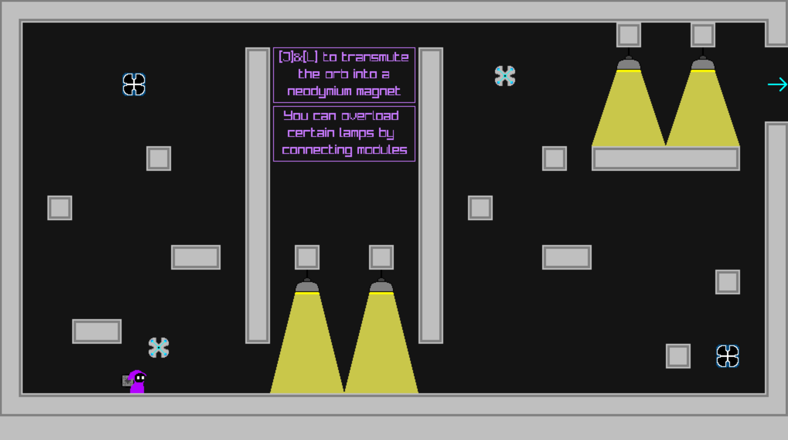
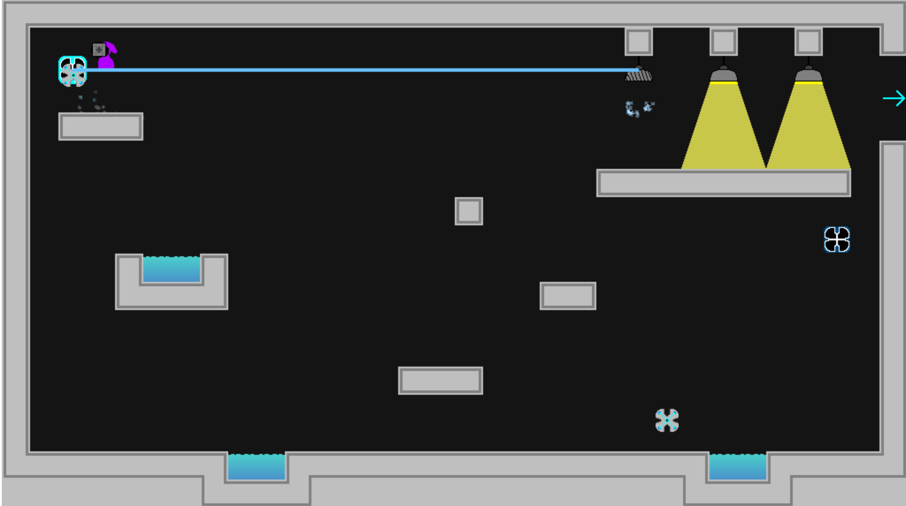

## Metallic

### Description

My second ever game jam submission, a small metal transmutation based platformer made for the "Pirate Software - Game Jam 15".

### Features

TBA

### Controls

Keyboard:
 - \[A\] to move left
 - \[D\] to move right
 - \[Space\] to jump
 - \[W\] to use Iron Ceiling
 - \[K\] to use Cesium Explosion
 - \[J\] to use Neodymium Magnet (left)
 - \[L\] to use Neodymium Magnet (right)

### Screenshots

### Developers

 - Turp2703 (myself) - Everything
 
### Links

 - itch.io Release: https://turp2703.itch.io/metallic